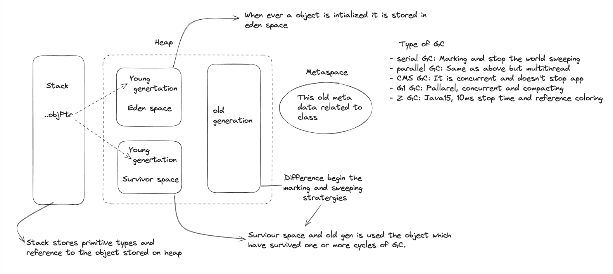

## Memory management in java

## Types of Reference
- Strong reference: Almost all type of object creation is strong reference.
   `Person person = new Person();`
- Weak reference: It is special type of object creation, which tells GC to dealloc it once GC starts.
   `WeakReference<Person> obj = new WeakReference<>(new Person());`
- Soft reference: It is special type of object creation, which tells GC to dealloc it if it's atmost important.
   `SoftReference<Person> obj = new SoftReference<>(new Person());`
