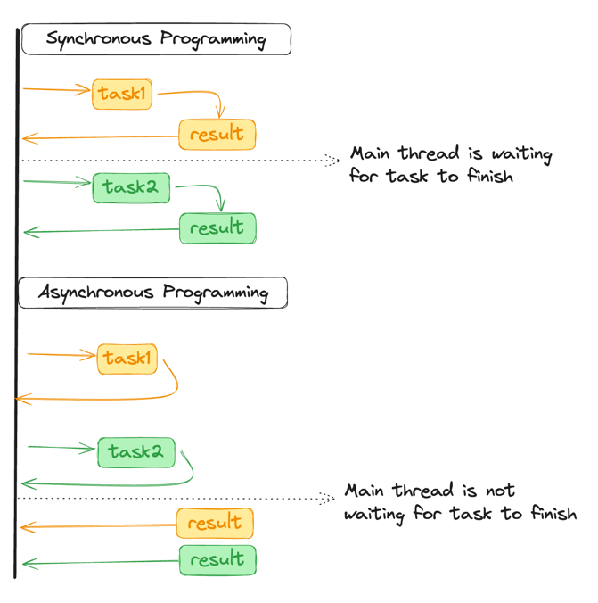

## Multithreading
Below are the ways we can achieve multithreading in java
- [Executors](./Executors)
- [ForkJoin](./ForkJoin)
- [Futures](./Future)
- [Synchronization](./Synchronization)

### What is concurrent?
An application is executing one or more than one task at
a same time seemingly, but not really at the same time. 
Above statement means CPU is executing multiple tasks at 
a same time, but it's doing context switching between the 
task.

### What is parallel?
An application is executing multiple task on the same time
on hardware that has multiple CPUs/Cores. No context switching 
is involved.

### What is Parallelism?
This is concept based on parallel execution where a task is 
broken in multiple subtask and all them are running on multiple
CPUs or CPU cores. For java, condition is more than one thread
running and each thread running on separate CPUs or CPU cores

### Process difference between Sync and Async tasks
